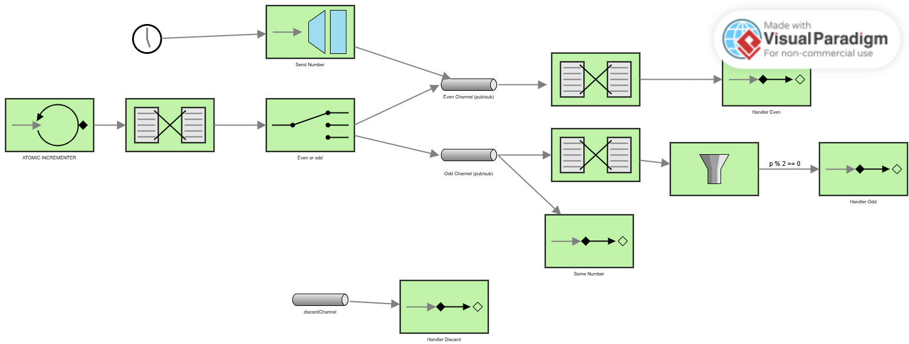

# Lab 5 Integration and SOA - Project Report

## 1. EIP Diagram (Before)

Describe what the starter code does and what problems you noticed.

---

## 2. Analysis of Issues:
- What was wrong in the starter code?
- Why did those issues prevent correct behavior?
- What patterns were misapplied?

---

## 3. Implementation Changes:
- What code did you modify?
- Why did you make each change?
- How do changes align with EIP patterns?

---

## 4. What You Learned

Write a few sentences about:

- What you learned about Enterprise Integration Patterns
- How Spring Integration works
- What was challenging and how you solved it

---

## 5. AI Disclosure

**Did you use AI tools?** (ChatGPT, Copilot, Claude, etc.)

- If YES: Which tools? What did they help with? What did you do yourself?
- If NO: Write "No AI tools were used."

**Important**: Explain your own understanding of the code and patterns, even if AI helped you write it.

---

## Additional Notes

Any other comments or observations about the assignment.
